<!-- Profile README for Suggus1899 -->

<p align="center">
  
</p>

```text
$ javac GustavoColina.java
$ java GustavoColina
[JVM] role    = FULL_STACK_DEVELOPER
[JVM] mission = TURN_MANUAL_WORKFLOWS_INTO_RELIABLE_SOFTWARE
[JVM] status  = OPEN_TO_REMOTE_COLLABORATION_
```

<p align="center">
  <a href="https://my-portafolio-puce.vercel.app/en"></a>
  <a href="mailto:gustavojose0819@gmail.com"></a>
  <a href="https://www.instagram.com/gus_gus1899/"></a>
</p>

<br />

## `01 :: ABOUT_ME.class`

Full-Stack Developer and Systems Engineering student (8/10 semesters) with production experience across REST APIs, databases, React/Next.js frontends and Flutter applications. I care about clean domain boundaries, useful automation and software that is easy to operate.

- 🔐 Built encrypted systems with AES-256-GCM and SQLCipher.
- 🧩 Shipped multi-tenant and role-based products across web, desktop and mobile.
- ☁️ Currently sharpening Java 21, Spring Boot 3, cloud networking and observability.
- 🌎 Based in Aragua, Venezuela · open to remote collaboration.

## `02 :: TOOLBOX.jar`

<p align="center">
  
</p>

<details>
  <summary><strong>See the complete technical stack</strong></summary>
  <br />

| Area | Technologies |
|---|---|
| Backend | Java · Spring Boot · Spring Security · Hibernate/JPA · Node.js · Express · NestJS · Go · Rust · Actix-web · Python · PHP · Socket.io |
| Frontend | TypeScript · React · Next.js · Vue.js · Angular · Tailwind CSS · Framer Motion · shadcn/ui · React Flow · Zustand · TanStack Query · Vite |
| Mobile / Desktop | Flutter · Dart · Tauri · Electron · Kotlin |
| Data | PostgreSQL · MySQL · SQLite · MongoDB · Redis · BullMQ · Prisma · Sequelize · MinIO |
| Cloud & DevOps | AWS · Vercel · Docker · Nginx · Turborepo · GitHub Actions · Swagger / OpenAPI |
| AI / LLMs | Prompt Engineering · OpenAI API · Gemini · Claude Code |

</details>

## `03 :: FEATURED_WORK.java`

<table>
  <tr>
    <td width="50%" valign="top">
      <h3><a href="https://github.com/Suggus1899/Visitors">🔐 Visitors — LogMaster SaaS</a></h3>
      <p>Multi-tenant visitor management with audit trails, ARCO/GDPR workflows, encrypted PII, rate limiting and 39 Playwright E2E tests.</p>
      <p><sub>Next.js · TypeScript · Node.js · PostgreSQL · Turborepo · Docker</sub></p>
    </td>
    <td width="50%" valign="top">
      <h3><a href="https://github.com/Suggus1899/Netlab-system">🌐 Netlab System</a></h3>
      <p>Interactive network simulator for protocols, firewalls and NAT, with packet animation, guided labs and automatic validation.</p>
      <p><sub>Next.js · React Flow · Express · Prisma · PostgreSQL · Zod</sub></p>
      <a href="https://learning-red-one.vercel.app">Live demo →</a>
    </td>
  </tr>
  <tr>
    <td width="50%" valign="top">
      <h3><a href="https://my-portafolio-puce.vercel.app/en">✨ Multilingual Portfolio</a></h3>
      <p>Portfolio available in four languages, with dark mode, technical writing, SEO and a validated contact workflow.</p>
      <p><sub>Next.js 16 · React 19 · Tailwind CSS 4 · next-intl · Framer Motion</sub></p>
    </td>
    <td width="50%" valign="top">
      <h3><a href="https://github.com/Suggus1899/MedAseets">🏥 MedAssets</a></h3>
      <p>Inventory, traceability and preventive-maintenance management for medical equipment across hospital networks.</p>
      <p><sub>TypeScript</sub></p>
    </td>
  </tr>
</table>

<p align="center">
  <a href="https://github.com/Suggus1899?tab=repositories"><strong>Explore all repositories →</strong></a>
</p>

## `04 :: EXPERIENCE.log`

<details open>
  <summary><strong>Full-Stack Programmer · KeoIT</strong> — Remote, Peru · Mar 2026–Present</summary>
  <br />
  Cross-platform Flutter client for Android, iOS and desktop, with role-based access, session management and Next.js participation on the web layer.
  <br /><br />
  <strong>Highlights:</strong> 40% faster app loading · RBAC for 500+ concurrent users · 95% shared code.
</details>

<br />

<details>
  <summary><strong>Senior Full-Stack Developer · Industrias de Alimentos El Trébol</strong> · 2025–2026</summary>
  <br />
  Designed and delivered LogMaster, an encrypted access-control and visitor-management system with reporting and differentiated operator roles.
  <br /><br />
  <strong>Highlights:</strong> process time cut from 10 minutes to under 1 · 10,000+ secured records · 200+ automated reports per month.
</details>

## `05 :: GITHUB_TELEMETRY.jvm`

<p align="center">
  
</p>

<p align="center"><sub>Source: GitHub API · refreshed hourly · owned, public, non-fork repositories. Commits are GitHub contribution totals excluding this profile repository. The language chart counts every repository by its primary language; remaining and unclassified repositories are grouped as “Other / none”.</sub></p>

## `06 :: EDUCATION.class`

- 🎓 Computer Engineering / Systems Engineering — 8 of 10 semesters completed
- 📊 Data Science, Prompt Engineering and SQL — DataCamp
- ☕ Java Fundamentals, OOP and Spring Boot — TodoCode

<p align="center">
  <br />
  <code>System.out.println("READY PLAYER TWO?");</code>
  <br /><br />
  <strong>Have a product or workflow that needs a thoughtful technical solution?</strong>
  <br /><br />
  <a href="mailto:gustavojose0819@gmail.com"></a>
  <br /><br />
  
  
</p>

<p align="center"><sub>© 2026 Gustavo Colina :: process finished with exit code 0_</sub></p>
